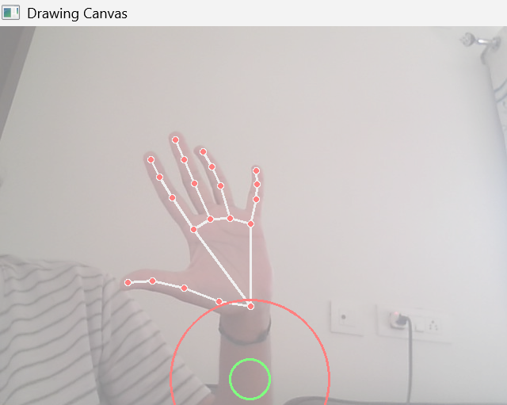
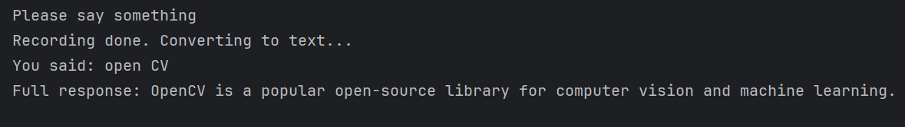
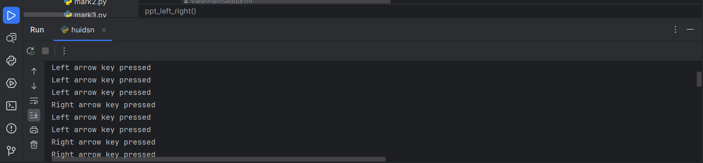

# 🚀 HUIDSN — Hands Of User In Digital System Networks

HUIDSN is an **AI-powered gesture-based human–computer interaction system** that enables users to control digital devices using **hand gestures, voice commands, and real-time annotation**.

This project focuses on accessibility, natural interaction, and productivity by replacing traditional input devices with intuitive hand movements.

## 🌟 Features

### 🖐️ Gesture-Based Controls
- Mouse cursor movement using hand tracking
- Left click and right click gestures
- Smooth cursor control with motion smoothing
- Dead-zone and speed-zone based movement system

### 🔊 System Controls
- Volume increase / decrease
- Mute / unmute
- Brightness adjustment
- PowerPoint slide navigation (left/right)

### 📝 Annotation Mode
- Draw on screen using finger gestures
- Erase drawings using thumb gesture
- Clear annotations instantly
- Save annotated images

### 🎙️ Voice Assistant Integration
- Voice-to-text using speech recognition
- AI response generation using Google Gemini
- Text-to-speech output for spoken responses

### 🖥️ System Tray Integration
- Taskbar icon menu for easy mode selection
- Switch between:
  - Brightness control
  - Volume control
  - Annotation mode
  - PowerPoint mode
  - Gesture clicking

## 📸 Screenshots

### 🖐️ Full Hand Open Gesture


### ✊ Fist Gesture


### 📝 Annotation Mode


### 🖥️ System Tray Menu


### 🎤 Speech to Text and Audio


### 🎞️ PowerPoint Controls



## 🧠 Tech Stack

- **Language**: Python
- **Computer Vision**: OpenCV, MediaPipe
- **Automation**: PyAutoGUI, pynput
- **System Control**: PyCAW (Audio), WMI (Brightness)
- **UI**: PyStray
- **AI & Voice**: SpeechRecognition, Google Generative AI (Gemini), pyttsx3
- **Utilities**: NumPy, Pillow

## 🚀 Installation

### 1️⃣ Clone the Repository

```bash
git clone https://github.com/VaishnaviSaggurthi/HUIDSN.git
cd HUIDSN
```

### 2️⃣ Install Dependencies

```bash
pip install opencv-python mediapipe pystray pillow pyautogui wmi pycaw numpy pynput speechrecognition pyttsx3 google-generativeai 
```
### 3️⃣ Set Gemini API Key
```bash
set GOOGLE_API_KEY=your_api_key_here
```
### Windows (PowerShell)
```
$env:GOOGLE_API_KEY="your_api_key_here"
```
### ▶️ Running the Project
```bash
python huidsn.py
```
Press Q to quit the application.

### 🎮 Core Functionalities

- Gesture-based cursor movement and click control

- Touchless brightness and volume control

- Gesture-controlled PowerPoint navigation

- Real-time virtual annotation canvas

- Voice assistant triggered by hand gestures

- System tray menu for quick mode switching

### 🎯 Use Cases
- Accessibility for users with limited mobility

- Touchless interaction systems

- Smart presentations

- AI-assisted productivity tools

- Gesture-controlled smart environments

### 🏗️ Architecture Overview

- Input Layer: Webcam feed processing with OpenCV

- Detection Layer: MediaPipe hand landmark detection

- Gesture Engine: Finger-state recognition and gesture mapping

- Action Layer: Mouse control, system control, annotation, voice interaction

- AI Layer: Voice recognition + Gemini response generation

### 🔒 Key Highlights

- Real-time hand tracking with low latency

- Smooth cursor movement with dead-zone logic

- Multi-mode interaction via taskbar menu

- Voice-driven AI assistant integration

- Lightweight and portable desktop application

### 👩‍💻 Author

Vaishnavi Saggurthi


Built with ❤️ using Python, OpenCV, MediaPipe, and AI.
